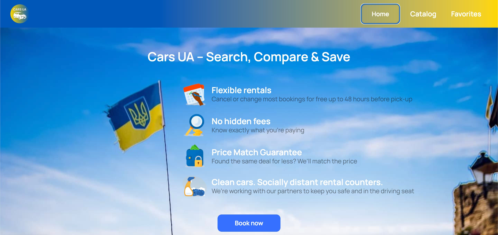
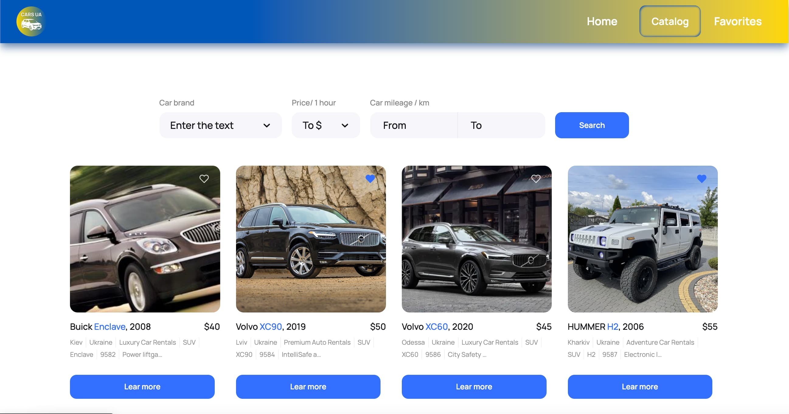
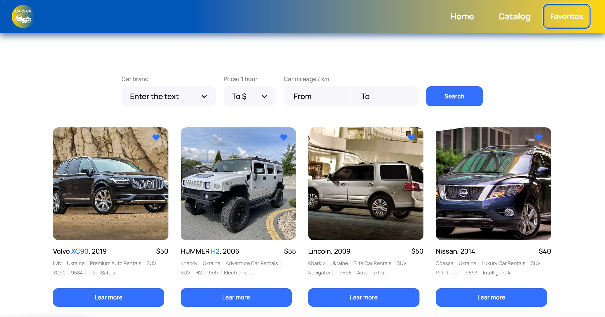

<h1 align="center">Cars UA</h1>
<h2 align="center">

## About this project

Cars UA is a SPA for fast and easy car rental. The site allows:

* searching cars by models, price or milage

* adding cars to the list of favorites

## Technologies and libraries used to create the project:

* This project was created with the help of [Vite + React](https://github.com/vitejs/vite)
* [React Router Dom](https://reactrouter.com/en/main)
* [Emotion Styled](https://emotion.sh/docs/styled)
* [Axios](https://axios-http.com/ru/docs/intro)
* [React Hook Form](https://react-hook-form.com)
* [React Select](https://react-select.com)
* HTML
* CSS

## Live page

Live page can be accessed via [https://margaritasukhova.github.io/cars-ua/](https://margaritasukhova.github.io/cars-ua/)
